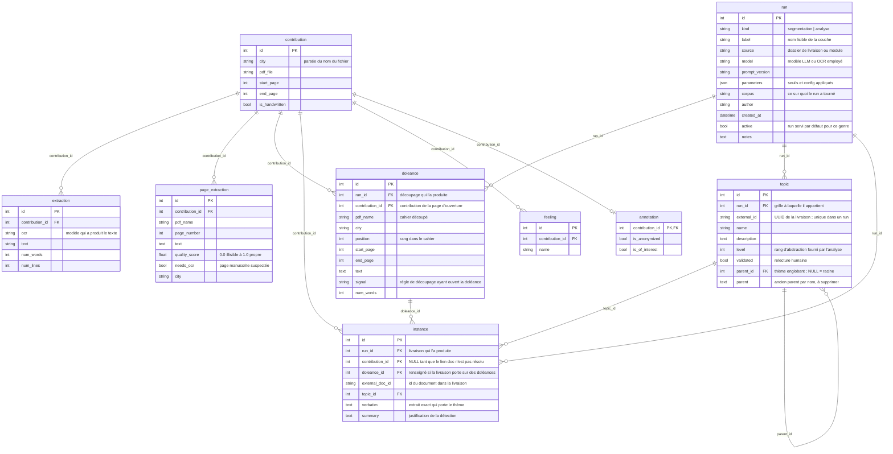

# Base de données : modèle et fonctionnement

## Le modèle



| Table | Contenu | Owner |
|---|---|---|
| `contribution` | métadonnées : commune, fichier, pages, manuscrit | équipe séparation |
| `extraction` | texte extrait une ligne par essai d'OCR | équipe extraction |
| `page_extraction` | texte extrait page par page (OCR-free) avec score de qualité et flag `needs_ocr` | équipe extraction |
| `page_transcription` | transcription OCR d'une page pour une passe donnée : texte, géométrie ligne à ligne, score wordfreq | `extraction/with_ocr/` |
| `run` | une production de couche interprétative : un découpage, une grille | `database/runs.py` |
| `doleance` | le texte d'un contributeur, découpé du cahier | `segmentation/` |
| `topic` | taxonomie des thèmes, hiérarchie via `parent_id` | équipe analyse |
| `instance` | détections de thèmes : verbatim + justification, une ligne par détection | équipe analyse |
| `feeling` | sentiments détectés : une ligne par résultat | équipe analyse |
| `annotation` | variables activées dans l'app ("Anonymisé", "d'intérêt") | outil Gradio |

**La logique** : une tâche métier = une table, chaque équipe n'écrit que dans la sienne
(CR de réunion), et tout pointe vers `contribution.id`. **La pertinence** : aucune donnée
n'est écrite par deux équipes, et l'avancement se lit par l'existence des lignes (pas de
ligne `extraction` = pas encore extraite, pas de ligne `annotation` = pas encore annotée).

## Les couches, et pourquoi elles sont versionnées

Le squelette du corpus, c'est la provenance : `contribution` -> `page_extraction`,
rattachés à un cahier et à une commune. Il ne bouge pas.

Le reste — le découpage en doléances, les thèmes, les détections — est une
**couche interprétative** posée dessus. Une heuristique décide qu'une page porte
trois auteurs ; un modèle décide qu'un paragraphe parle de fiscalité. Ces
décisions doivent être visibles, attribuées, comparables et réversibles, donc
versionnées : c'est le rôle de `run`.

Avant cette table, `load_analysis.py` faisait `DELETE FROM instance` à chaque
livraison et `charger_topics` upsertait dans une table `topic` unique : **une
seule grille pouvait exister à la fois**, et rien ne disait de quel modèle ni de
quel prompt elle venait. Charger une grille pour la comparer détruisait
l'ancienne.

Sept genres aujourd'hui : `segmentation`, `analyse`, `doublons`,
`anonymisation`, `embeddings`, `typologie` et `transcription`. Dans chaque
genre, un seul
run est `active` — c'est celui que l'app et les exports servent — garanti par un
index unique partiel, pas seulement par le code appelant. Les autres restent en
base, lisibles et comparables.

```python
from database.runs import ANALYSE, SEGMENTATION, creer_run, run_actif, runs

creer_run(session, ANALYSE, label="grille émergente v4", model="qwen3-4b", ...)
run_actif(session, ANALYSE)   # la grille servie, ou None sur une base vierge
runs(session, ANALYSE)        # toutes les grilles, de la plus récente à la plus ancienne
```

**Un run est toujours attribué.** `run.author` est `NOT NULL` depuis le
10 septembre 2026 : `creer_run` résout l'auteur d'office quand la commande ne le
donne pas — `--auteur`, puis la variable `CAHIER_DOLEANCES_AUTEUR`, puis la
configuration git du dépôt, puis le compte système (`database/auteur.py`). Avant
cela l'auteur était seulement *réclamé*, par un message imprimé en fin de
commande ; la base porte encore quatre runs anonymes, comblés en `inconnu` par la
migration, pour montrer ce que valait le rappel. Une couche interprétative qu'on
ne peut rattacher à personne ne se discute pas, elle se subit.

`run_actif` renvoyant `None` est un **état normal** (base migrée mais pas encore
chargée) : les lectures le traitent comme « couche vide », pas comme une erreur.
L'app l'exprime en SQL — `WHERE t.run_id = (SELECT id FROM run WHERE kind='analyse' AND active)`
— la sous-requête vaut NULL, la comparaison n'est jamais vraie, les vues sont vides.

**Le texte de lecture d'une page** (`database/pages.py`) est le point où la
couche `transcription` rejoint le squelette, sans l'écraser. `lire_pages`
choisit page par page : la transcription du run `transcription` actif si la
page en a une, sinon `page_extraction.text` si la page n'est pas `needs_ocr`,
sinon rien. Segmentation, export vers l'analyse, couverture et app passent
tous par là et lisent le même texte ; activer un autre run de transcription
change la lecture de tout le monde d'un coup, la désactiver ramène au
squelette seul. Un commentaire de modèle sur une page vide (« Cette image ne
contient aucun texte ») y est lu comme un texte vide, pas comme une doléance.

```python
from database.pages import lire_pages

for lue in lire_pages(session):          # les pages lisibles, ordre des cahiers
    lue.page.pdf_name, lue.texte, lue.source   # "squelette" | "transcription"
```

**Conséquence sur l'unicité** : `topic.external_id` n'est plus unique dans la
table mais dans un run (`uq_topic_run_external_id`). Deux grilles peuvent
réutiliser le même UUID de livraison. De même, les noms de thèmes ne sont uniques
que dans une grille — toute lecture qui s'appuie dessus doit filtrer sur le run.

## Vecteurs : la base est prête, le modèle n'est pas choisi

`pgvector` est installé (extension `vector`) et la table `embedding` attend ses
vecteurs, rattachés à un run de genre `embeddings` comme toute autre lecture du
corpus. Table à part et non colonne sur `doleance` : un vecteur dépend d'un
modèle, de sa version et du découpage du texte qu'on lui a donné.

**La colonne `vector` n'a pas de dimension déclarée**, et ce n'est pas un oubli.
La dimension dépend du modèle, qui n'est pas choisi — et ce choix n'est pas
seulement technique : ces textes sont des opinions politiques nominatives, la
passe doit tourner en local ou chez un sous-traitant européen. pgvector accepte
un vecteur non contraint mais **refuse de l'indexer** : une recherche
vectorielle fera donc un parcours complet, ce qui est sans conséquence sur mille
doléances. Le jour où le modèle est choisi, une migration fixe la dimension et
pose l'index HNSW.

L'extension n'est pas dans l'image `postgres:16` : `compose.yaml` pointe sur
`pgvector/pgvector:pg16`, la même image avec l'extension compilée dedans. Le
volume de données passe de l'une à l'autre sans rien perdre, mais **la version
de glibc change, donc celle des collations** — il faut réindexer, et
`compose.yaml` porte la commande.

## Mettre à jour le modèle de données

La source de vérité est `database/models.py` ; Alembic versionne chaque évolution dans
`database/migrations/versions/` (committé, rejouable sur une base vierge).

Évolution **additive** (nouvelle colonne, nouvelle table) :

1. Modifier `database/models.py`
2. `uv run alembic revision --autogenerate -m "description"`
3. **Relire** le script généré dans `database/migrations/versions/`
4. `uv run alembic upgrade head`
5. Committer `models.py` + la migration

Évolution **destructive** (supprimer une colonne) : jamais en un coup — dump d'abord,
puis trois migrations *expand → backfill → contract* avec vérification chiffrée avant
le contract (voir les migrations du passage aux instances de topics comme exemple :
`expand ref_topic` → `backfill topic.name` → `contract suppression de topic.name`).

**Renommage** (table ou colonne) : `--autogenerate` ne le détecte pas — il générerait un
`drop` + `create` destructeur. On écrit la migration à la main avec `op.rename_table` /
`op.alter_column(new_column_name=…)`, qui préservent données, index et FK (voir la
migration `rename : topic -> instance, ref_topic -> topic`).

L'autogenerate crée les contraintes avec le nom `None`, ce qui rend le `downgrade`
inapplicable : les nommer à la main (`op.create_unique_constraint("uq_...", ...)`).

Ne pas reformater une migration déjà appliquée : c'est une archive, la retoucher
ne produit que du bruit dans les diffs et des conflits de merge.

La connexion est construite par `database/db.py` depuis `.env` (ou `DATABASE_URL`
pour un SQLite local) — jamais de credentials dans un fichier committé.

## Échange avec l'analyse

L'export du corpus vers `topic-builder` et le chargement de la livraison qui
en revient (une grille de thèmes, un run de genre `analyse`) sont dans
[`analyse/`](../analyse/README.md), avec le format d'identifiant que les deux
partagent.

## Commandes

```bash
uv run alembic revision --autogenerate -m "..." # générer une migration
uv run alembic upgrade head # appliquer à la base
uv run alembic current # version actuelle de la base
uv run alembic check # écart entre models.py et la base
uv run python -m database.seed_mock # seed de démo : 4 contributions dactylographiées réelles
```

## Dumps

Format custom `pg_dump`, nommés `<base>_<date>[_<étape>].dump`. Ils contiennent
`alembic_version`, donc la version de schéma voyage avec les données.

- **En local** : `database/backups/` (ignoré par git, les dumps contiennent le
  texte des cahiers).
- **Sur S3** : bucket `cahiers-upload`, préfixe `backups/`. Le script
  `gradio_app/s3_helpers.py` ne lit que les `.pdf`, un dump n'interfère donc pas
  avec l'aperçu PDF.

Dump avant toute évolution destructive :

```bash
set -a; . ./.env; set +a
PGPASSWORD="$DB_PASSWORD" pg_dump -h "$DB_HOST" -p "$DB_PORT" -U "$DB_USER" -d "$DB_NAME" \
  --format=custom --no-owner --no-privileges \
  --file="database/backups/${DB_NAME}_$(date +%F).dump"
```

Restaurer :

```bash
PGPASSWORD="$DB_PASSWORD" pg_restore -h "$DB_HOST" -p "$DB_PORT" -U "$DB_USER" -d "$DB_NAME" \
  --clean --if-exists --no-owner database/backups/<fichier>.dump
```
